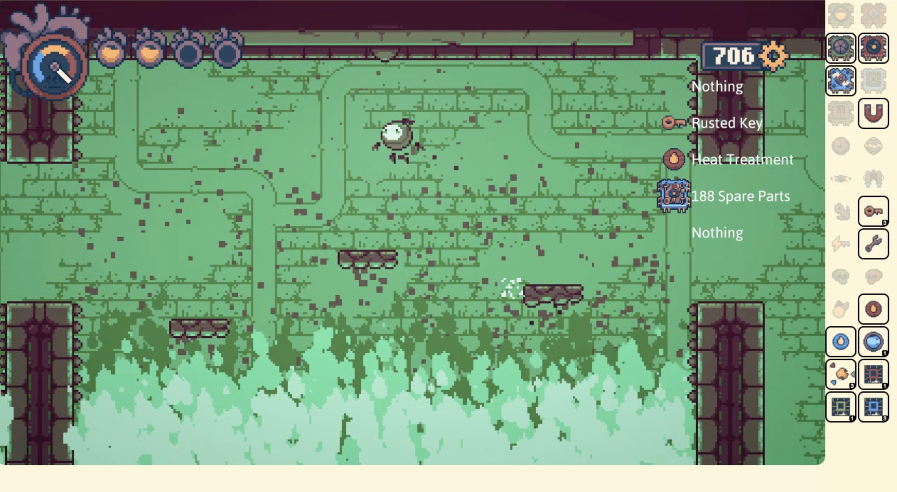

# InventoryWebTracker

This is a mod that provides a web interface to display the current
inventory of the player in real-time, suitable for use as a browser source
in [OBS][] or other similar software for streaming and recording.

[OBS]: https://obsproject.com/

## Screenshot

## How to use

After launching the game and enabling this mod in your configuration,
access http://localhost:8086 in your browser (or connect a browser source
to it).

If you do this initially before loading into any files, some of
the icons in the tracker will appear missing, as the game has not loaded
them yet. To fix this, load into any file and refresh the tracker's
page/browser source.

## Customization

You may change the tracker's appearance and contents by editing the HTML and
CSS code in [WebUI.cs](InventoryWebTracker/WebUI.cs). The elements
corresponding to each item must have a `slotN` id property so that the
included JavaScript code will turn them on or off at appropriate times.
For items that are countable (like power cells), there should be an element
with an `amountN` id as well, which will be used to display the amount of that
item in your inventory.

The icons for each item are provided under the path `/icons/`. 
The available slots and respective icons are as follows:

Chips (icons `chip0.png` through `chip27.png`):

- slot0: Ferromagnetic
- slot1: Gyro-Accelerator
- slot2: Coolant Soluble
- slot3: Power Processor
- slot4: Map Sweeper
- slot5: Extractor
- slot6: Auto Modifier
- slot7: Infinity Edge
- slot8: Agile Alloy
- slot9: Electro-Emitter
- slot10: Sword Extension
- slot11: Bulb Relation
- slot12: Shock Wave
- slot13: Shock Projectile
- slot14: Protector's Capsule
- slot15: Pocket Magnet
- slot16: Self-Detonation
- slot17: Tungsten Steel
- slot18: Nomad's Plate
- slot19: Sawblade
- slot20: Amplifying Transputer
- slot21: Quick Repair
- slot22: Magnetic Footing
- slot23: Power Enhancer
- slot24: Auto Repair
- slot25: Heat Drive
- slot26: Electric Orbs
- slot27: Space Disturbance

Abilities (icons `ability0.png` through `ability5.png`):

- slot28: Electro-Magnetism
- slot29: Body Modifier (Ball)
- slot30: Power Bomb
- slot31: Space Disruptor (Blink)
- slot32: Jump Booster (double jump)
- slot33: String and Hook (Grapple)

Other items and their icons:

- slot34: Rusted Keys (`item0.png`)
- slot35: Electric Key (`item1.png`)
- slot36: Whistle (`item2.png`)
- slot37: Capsule Fragment (`item3.png`)
- slot38: Sword (`item4.png`)
- slot39: Wrench (`item5.png`)
- slot40: Cassette Tape (`item6.png`)
- slot41: Green Human Skull (`item7.png`)
- slot42: Red Human Skull (`item8.png`)
- slot43: Bulblet (`bulblet.png`)
- slot44: Heat Treatment (`fireres.png`)
- slot45: Sealant Treatment (`waterres.png`)
- slot46: Power Cells (`powercell.png`)
- slot47: Liquid Coolant (`coolant.png`)
- slot48: Red Chip Slots (`redchipslot.png`)
- slot49: Green Chip Slots (`greenchipslot.png`)
- slot50: Blue Chip Slots (`bluechipslot.png`)
